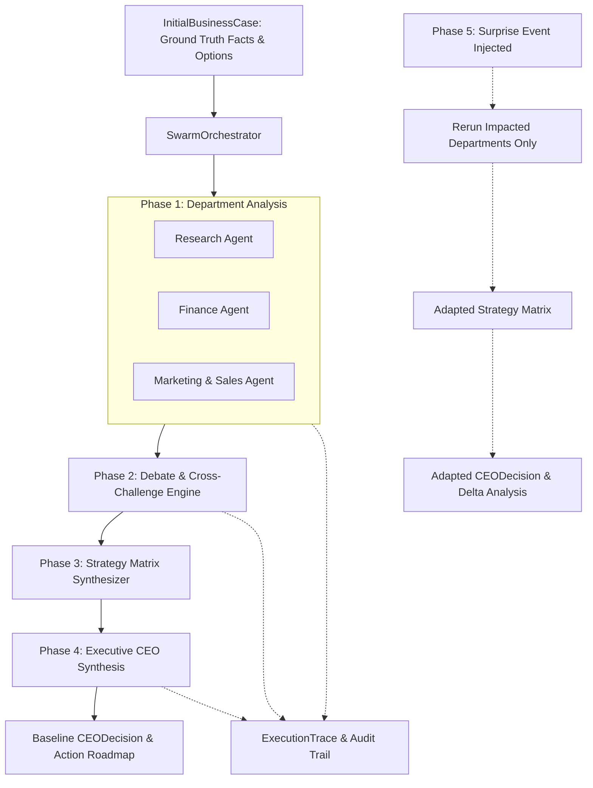

# Fireflies — Agentic Swarm Decision System

A reusable, multi-agent business decision swarm that accepts runtime business test cases and produces explainable, auditable, and adaptable executive decisions.

---

## 📌 Overview

**Fireflies** simulates a collaborative executive boardroom of specialized AI agents working through a structured decision-making pipeline:

$$\text{Analyse} \longrightarrow \text{Share} \longrightarrow \text{Challenge} \longrightarrow \text{Compare} \longrightarrow \text{Decide} \longrightarrow \text{Adapt (Surprise Condition)}$$

The swarm operates on generic runtime business cases rather than pre-baked outcomes, providing structured evidence, debate traces, strategy comparisons, and dynamic replanning when conditions change.

---

## 🏛 Architecture & Workflow



---

## 📦 7 Core Pydantic Schemas

| Schema | Purpose | Description |
| :--- | :--- | :--- |
| **`InitialBusinessCase`** | Immutable Input | Verified ground-truth facts (`BusinessFacts`), decision goals/constraints (`DecisionContext`), and candidate options (`StrategicOption`). Zero surprise data leakage. |
| **`AgentTask`** | Orchestrator Dispatch | Task lifecycle tracking (`pending`, `running`, `completed`, `failed`), retries, and error handling. |
| **`AgentAnalysis`** | Department Output | Strictly typed findings, recommendations, evidence, assumptions, risks, and confidence scores from Research, Finance, and Marketing. |
| **`DebateMessage`** | Inter-Agent Debate | Structured cross-examination messages (`challenge`, `response`, `clarification`, `concession`). |
| **`StrategyComparison`** | Strategy Matrix | Formal multi-dimensional evaluation of Option A vs Option B across advantages, disadvantages, impacts, risks, and trade-offs. |
| **`CEODecision`** | Executive Decision | Definite decision statement, department evidence rationale, rejected alternatives with reasons, trade-offs, and $\ge 3$ measurable business KPIs. |
| **`SurpriseEvent`** | Disruption Payload | Runtime unexpected events targeting specific `impacted_areas` (`List[Department]`) with updated parameter deltas. |
| **`ExecutionTrace`** | Boardroom Audit Trail | Timestamped log of all agent starts, completions, debate exchanges, strategy comparisons, and decisions for judging review. |
| **`SwarmState`** | End-to-End State | Comprehensive state container tracking the entire swarm lifecycle. |

---

## 👥 Team Split & Ownership

```
Fireflies/
├── state/             # Person A (Shared schemas & SwarmState contract)
├── orchestrator/      # Person A (State transitions, debate coordinator, strategy comparator)
├── agents/
│   ├── ceo/          # Person A (Executive synthesis & surprise adaptation)
│   ├── research/     # Person B (Market research, TAM, competitor analysis)
│   ├── finance/      # Person B (Unit economics, CapEx, runway, profitability)
│   └── marketing/    # Person C (GTM strategy, channel acquisition, CAC positioning)
├── traces/            # Person C (Execution logger & boardroom demo viewer)
├── tests/             # Shared test cases & test suites
└── utils/             # Shared LLM structured-output client
```

### Team Responsibilities:
* **Person A — Swarm Architect / Orchestrator** (`feature/orchestrator-ceo`):
  * Core orchestration engine (`orchestrator/engine.py`).
  * CEO Agent (`agents/ceo/agent.py`).
  * Debate and strategy comparison coordination (`orchestrator/debate.py`, `orchestrator/strategy.py`).
* **Person B — Research + Finance** (`feature/research-finance`):
  * Research Agent (`agents/research/`).
  * Finance Agent (`agents/finance/`).
  * Fact vs. assumption validation.
* **Person C — Marketing + Trace / Evidence** (`feature/marketing-trace`):
  * Marketing & Sales Agent (`agents/marketing/`).
  * Execution trace logger & judge demo view (`traces/`).

---

## 🚀 Getting Started

### 1. Clone & Setup
```bash
git clone https://github.com/ashen-hycind/Fireflies.git
cd Fireflies

# Create virtual environment
python -m venv .venv
# On Windows:
.venv\Scripts\activate
# On Mac/Linux:
source .venv/bin/activate

# Install dependencies
pip install -r requirements.txt
```

### 2. Configure API Keys
Create a `.env` file in the project root:
```ini
# Google Gemini (Recommended - Free Tier available at aistudio.google.com)
GEMINI_API_KEY=AIzaSy...
DEFAULT_FAST_MODEL=gemini-1.5-flash
DEFAULT_REASONING_MODEL=gemini-1.5-flash

# OR OpenAI
OPENAI_API_KEY=sk-...
DEFAULT_FAST_MODEL=gpt-4o-mini
DEFAULT_REASONING_MODEL=gpt-4o
```

### 3. Run the Swarm CLI
```bash
python run_swarm.py
```

### 4. Run Automated Tests
```bash
python -m pytest tests/
```

---

## 📄 License
This project is licensed under the MIT License.
