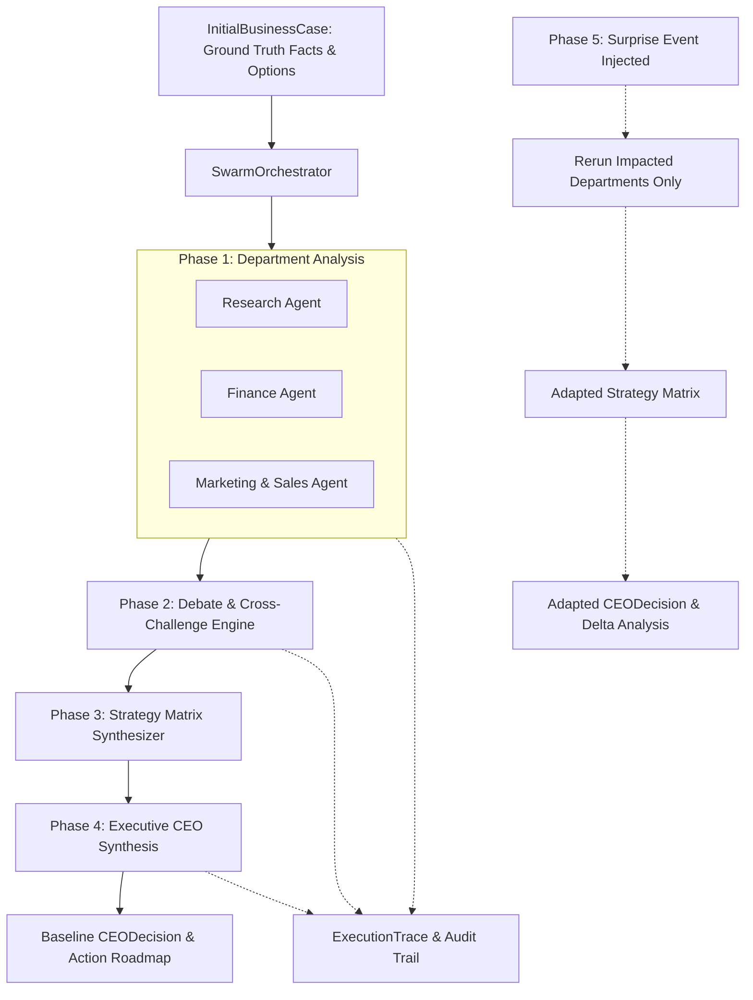

# Fireflies — Agentic Swarm Decision System

A reusable, multi-agent business decision swarm that accepts runtime business test cases and produces explainable, auditable, and adaptable executive decisions.

---

## 📌 Overview

**Fireflies** simulates a collaborative executive boardroom of specialized AI agents working through a structured decision-making pipeline:

$$\text{Analyse} \longrightarrow \text{Share} \longrightarrow \text{Challenge} \longrightarrow \text{Compare} \longrightarrow \text{Decide} \longrightarrow \text{Adapt (Surprise Condition)}$$

The swarm operates on generic runtime business cases rather than pre-baked outcomes, providing structured evidence, debate traces, strategy comparisons, and dynamic replanning when conditions change.

---

## 🏛 Architecture & Workflow



---

## 📦 7 Core Pydantic Schemas

| Schema | Purpose | Description |
| :--- | :--- | :--- |
| **`InitialBusinessCase`** | Immutable Input | Verified ground-truth facts (`BusinessFacts`), decision goals/constraints (`DecisionContext`), and candidate options (`StrategicOption`). Zero surprise data leakage. |
| **`AgentTask`** | Orchestrator Dispatch | Task lifecycle tracking (`pending`, `running`, `completed`, `failed`), retries, and error handling. |
| **`AgentAnalysis`** | Department Output | Strictly typed findings, recommendations, evidence, assumptions, risks, and confidence scores from Research, Finance, and Marketing. |
| **`DebateMessage`** | Inter-Agent Debate | Structured cross-examination messages (`challenge`, `response`, `clarification`, `concession`). |
| **`StrategyComparison`** | Strategy Matrix | Formal multi-dimensional evaluation of Option A vs Option B across advantages, disadvantages, impacts, risks, and trade-offs. |
| **`CEODecision`** | Executive Decision | Definite decision statement, department evidence rationale, rejected alternatives with reasons, trade-offs, and $\ge 3$ measurable business KPIs. |
| **`SurpriseEvent`** | Disruption Payload | Runtime unexpected events targeting specific `impacted_areas` (`List[Department]`) with updated parameter deltas. |
| **`ExecutionTrace`** | Boardroom Audit Trail | Timestamped log of all agent starts, completions, debate exchanges, strategy comparisons, and decisions for judging review. |
| **`SwarmState`** | End-to-End State | Comprehensive state container tracking the entire swarm lifecycle. |

---

## 👥 Team Information — NULL POINTERS

* **Team Name:** `NULL POINTERS`
* **Member 1:** ASHEN HYCIND (`25BCE5401`)
* **Member 2:** MADHAV MULLICK (`25BCE5184`)
* **Member 3:** UDAYAN NATH (`25BCE5196`)

---

## 🤖 Agent List & Roles

Fireflies employs a modular, domain-specialized swarm architecture where each agent operates with dedicated system instructions, analytical schemas, and epistemic boundaries:

| Agent | Module Path | Primary Role & Responsibilities |
| :--- | :--- | :--- |
| **CEO Agent** | [`agents/ceo/agent.py`](file:///c:/Users/ashen/Work/Fireflies/agents/ceo/agent.py) | **Executive Synthesis & Replanning:** Synthesizes cross-department findings, resolves inter-agent debate challenges, performs multi-option trade-off evaluations, generates concrete quantitative action roadmaps, and leads shock adaptation replanning with before-and-after deltas. |
| **Research Agent** | [`agents/research/agent.py`](file:///c:/Users/ashen/Work/Fireflies/agents/research/agent.py) | **Market & Competitive Intelligence:** Analyzes TAM/SAM/SOM market sizing, competitor positioning, industry benchmarks, demand dynamics, and separates empirical ground-truth facts from speculative assumptions. |
| **Finance Agent** | [`agents/finance/agent.py`](file:///c:/Users/ashen/Work/Fireflies/agents/finance/agent.py) | **Unit Economics & Fiscal Feasibility:** Evaluates CapEx/OpEx, cash runway, gross/net margins, burn rates, pricing sensitivity, financial risk thresholds, ROI, and balance sheet impact. |
| **Marketing & Sales Agent** | [`agents/marketing/agent.py`](file:///c:/Users/ashen/Work/Fireflies/agents/marketing/agent.py) | **Go-To-Market (GTM) & Acquisition:** Models Customer Acquisition Cost (CAC), Lifetime Value (LTV:CAC ratio), sales funnel velocity, channel strategy, customer segment positioning, and marketing campaign budgets. |
| **Product Agent** | [`agents/product/agent.py`](file:///c:/Users/ashen/Work/Fireflies/agents/product/agent.py) | **Product Strategy & Roadmap:** Evaluates feature prioritization, MVP scoping, user personas, UI/UX trade-offs, product-market fit metrics, and feature backlog staging. |
| **Engineering Agent** | [`agents/engineering/agent.py`](file:///c:/Users/ashen/Work/Fireflies/agents/engineering/agent.py) | **Technical Architecture & Feasibility:** Analyzes system scalability, tech stack trade-offs, engineering sprint capacity (engineer-months), technical debt, SLA/latency guarantees, and integration complexities. |
| **Customer Success Agent** | [`agents/customer_success/agent.py`](file:///c:/Users/ashen/Work/Fireflies/agents/customer_success/agent.py) | **Retention & Customer Health:** Analyzes onboarding velocity, churn risk indicators, support SLAs, customer satisfaction/NPS metrics, and post-sales account expansion opportunities. |
| **Risk & Compliance Agent** | [`agents/risk_compliance/agent.py`](file:///c:/Users/ashen/Work/Fireflies/agents/risk_compliance/agent.py) | **Governance & Regulatory Guardrails:** Evaluates regulatory compliance (e.g., GDPR, HIPAA, SOC2, financial regulations), governance exposure, operational risk vectors, and mitigation guardrails. |

---

## 🛠 Models, Frameworks & External Services Used

### 1. Large Language Models (LLMs)
* **Google Gemini:** `gemini-2.0-flash`, `gemini-2.0-pro` (via Google AI Studio).
* **OpenAI:** `gpt-4o-mini`, `gpt-4o` (via OpenAI API).

### 2. Frameworks & Core Libraries
* **Language & Runtime:** Python 3.10+ / 3.12.
* **Schema Validation & Data Contracts:** [`pydantic>=2.7.0`](https://pydantic.dev) (Pydantic v2) for strict structured JSON outputs, typed state contracts, and nested schema validation.
* **Official Model SDKs:**
  * [`google-genai>=1.0.0`](https://pypi.org/project/google-genai/) (Google GenAI SDK with structured response schema support).
  * [`openai>=1.30.0`](https://pypi.org/project/openai/) (OpenAI Python SDK with structured response parsing).
* **Configuration Management:** [`python-dotenv>=1.0.1`](https://pypi.org/project/python-dotenv/) for API key and runtime model configuration.
* **CLI & Boardroom Visualizer:** [`rich>=13.7.0`](https://pypi.org/project/rich/) for interactive boardroom terminal UI, colored decision tables, and formatted trace streaming.
* **Automated Testing:** [`pytest>=8.0.0`](https://pytest.org) for automated unit, integration, and end-to-end swarm test suites.

### 3. External Services
* **Google AI Studio API** (for Gemini model inference).
* **OpenAI API** (for GPT model inference).

---

## 🛡 Known Limitations & Failure Handling

### Failure Handling & Resilience Mechanisms
1. **Automated LLM Retries & Fail-Fast Fallbacks:**
   * The unified client ([`utils/llm.py`](file:///c:/Users/ashen/Work/Fireflies/utils/llm.py)) implements an exponential retry mechanism (`max_retries=2`) to handle transient API hiccups and schema validation anomalies.
   * Immediate validation checks verify API keys before dispatch, preventing unhandled cascading failures.
2. **Independent AST Arithmetic & Reconsideration Validator:**
   * [`orchestrator/validator.py`](file:///c:/Users/ashen/Work/Fireflies/orchestrator/validator.py) employs a safe Abstract Syntax Tree (AST) evaluator (`_safe_eval_expr`) to verify arithmetic formulas, sums, products, and percentages dynamically produced by the CEO without using unsafe `eval()`.
   * Rejects vague reaffirmations and verifies that retained strategies recalculate balances and satisfy hard constraints.
3. **Epistemic Truth Classification:**
   * Distinguishes verified facts (`FACT`, `SOURCE`) from speculative projections (`ASSUMPTION`, `FORECAST`, `CALCULATED`) to prevent hallucinated assumptions from contaminating executive decisions.
4. **Task-Level Fault Tolerance:**
   * The `AgentTask` lifecycle status (`pending`, `running`, `completed`, `failed`) isolates department failures, ensuring a partial failure in one department does not crash the entire boardroom state.
5. **Selective Disruption Adaptation:**
   * When unexpected events occur (`SurpriseEvent`), the orchestrator selectively re-runs only the impacted departments rather than performing naive, costly global recalculations.

### Known Limitations
* **API Rate Limits & Latency:** Multi-round agent debates and cross-examinations require multiple sequential LLM calls, bounded by provider API rate limits.
* **Deterministic Math in Arbitrary Complex Non-Linear Systems:** While linear equations, capacity balancing, and weighted expected values are checked via the AST validator, complex non-linear simulations rely on step-by-step arithmetic formatting from the model.
* **Context Budgeting:** Extremely large uncurated datasets must be summarized into structured facts to stay within token budgets and avoid context dilution.

---

## 📜 Declaration of Pre-Existing & Reused Components

* **Reused Open-Source Libraries:**
  * Standard open-source utilities: `pydantic` (schema modeling), `google-genai` and `openai` (official API SDKs), `python-dotenv` (environment configuration), `rich` (terminal formatting), and `pytest` (test framework).
* **Custom Original Implementation:**
  * All multi-agent orchestration engines (`orchestrator/engine.py`, `orchestrator/debate.py`, `orchestrator/strategy.py`), domain prompts and logic across all 8 department agents (`agents/`), independent AST math and constraint validator (`orchestrator/validator.py`), boardroom audit trail logging (`traces/logger.py`), and evidence rubric verifier (`traces/evidence_verifier.py`) are **100% custom-built for Fireflies**.
  * **No black-box multi-agent orchestration frameworks** (such as LangChain, CrewAI, or AutoGen) were used; all state transitions, structured validation, and debate mechanics are native and fully auditable.

---

## 🚀 Getting Started

### 1. Clone & Setup
```bash
git clone https://github.com/ashen-hycind/Fireflies.git
cd Fireflies

# Create virtual environment
python -m venv .venv
# On Windows:
.venv\Scripts\activate
# On Mac/Linux:
source .venv/bin/activate

# Install dependencies
pip install -r requirements.txt
```

### 2. Configure API Keys
Create a `.env` file in the project root:
```ini
# Google Gemini (Recommended - Free Tier available at aistudio.google.com)
GEMINI_API_KEY=AIzaSy...
DEFAULT_FAST_MODEL=gemini-2.0-flash
DEFAULT_REASONING_MODEL=gemini-2.0-pro

# OR OpenAI
OPENAI_API_KEY=sk-...
DEFAULT_FAST_MODEL=gpt-4o-mini
DEFAULT_REASONING_MODEL=gpt-4o
```

### 3. Run the Swarm CLI
```bash
python run_swarm.py
```

---

## 📄 License
This project is licensed under the MIT License.

## Contributors
- Udayan Nath
- Madhav Mullick
- Ashen Hycind
