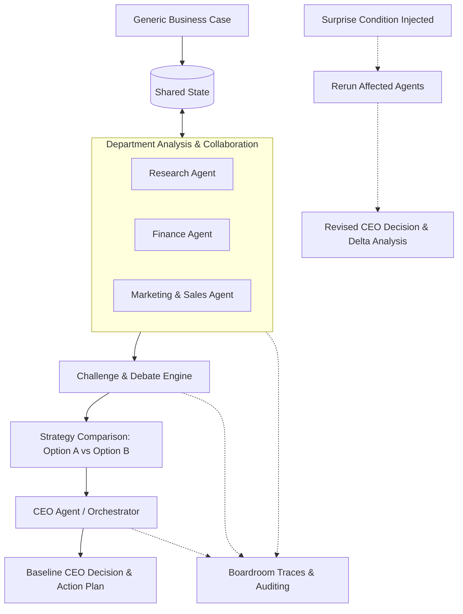

# Fireflies — Agentic Swarm Decision System

A reusable, multi-agent business decision swarm that accepts runtime business test cases and produces explainable, auditable, and adaptable executive decisions.

---

## 📌 Overview

**Fireflies** simulates a collaborative executive boardroom of specialized AI agents working through a structured decision-making pipeline:

$$\text{Analyse} \longrightarrow \text{Share} \longrightarrow \text{Challenge} \longrightarrow \text{Compare} \longrightarrow \text{Decide} \longrightarrow \text{Adapt (Surprise Condition)}$$

The swarm operates on generic runtime business cases rather than pre-baked outcomes, providing structured evidence, debate traces, strategy comparisons, and dynamic replanning when conditions change.

---

## 🏛 Architecture & Agent Roles



### Agent Responsibilities

| Agent / Role | Primary Responsibility | Key Inputs & Outputs |
| :--- | :--- | :--- |
| **CEO Agent / Swarm Architect** | System orchestration, conflict synthesis, strategy comparison, final decision formulation, surprise handling. | Multi-agent outputs $\to$ Structured CEO Decision, Trade-off matrix, KPIs, implementation plan. |
| **Research Agent** | Market analysis, competitor intelligence, customer segment research, opportunities & market risks. | Business case $\to$ Structured market research, clear separation of facts vs. assumptions. |
| **Finance Agent** | Unit economics, cost-revenue modeling, capital expenditure, profitability, affordability & financial risks. | Market data & case $\to$ Financial feasibility, unit economics, risk exposure. |
| **Marketing & Sales Agent** | Target audience positioning, GTM strategy, acquisition channels, conversion models. | Research & finance data $\to$ GTM plan, acquisition metrics, positioning strategy. |
| **Trace & Evidence Engine** | Real-time logging of inter-agent messages, challenge/defence exchanges, decision traces, and evaluation logs. | Swarm message streams $\to$ Auditable execution logs, judge-ready trace view. |

---

## 👥 Team Split & Ownership

### **Person A — Swarm Architect / Orchestrator**
- **Owns:** Orchestration framework, shared state management, CEO agent, debate flow, strategy comparison ($A$ vs $B$), surprise condition injection, and failure/fallback controls.
- **Key Modules:** `orchestrator/`, `state/`, `agents/ceo/`

### **Person B — Research + Finance**
- **Owns:** Analytical department agents, prompt engineering, structured JSON outputs, separating verified facts from assumptions, data validation.
- **Key Modules:** `agents/research/`, `agents/finance/`

### **Person C — Marketing + Trace / Evidence**
- **Owns:** Marketing & Sales agent, auditable boardroom trace engine, disagreement & defence visualization, and judge demo presentation.
- **Key Modules:** `agents/marketing/`, `traces/`, evidence/demo views.

---

## 🔄 Execution Phases

1. **Phase 1: Architecture Alignment**
   - Agree on generic business input schema, shared state structure, and JSON protocols.
   - Establish inter-agent communication, challenge mechanism, and CEO decision schema.
2. **Phase 2: Parallel Development**
   - Build specialized agents, state machine, orchestrator, and trace loggers in parallel.
3. **Phase 3: Swarm Integration**
   - Connect $\text{Research} + \text{Finance} + \text{Marketing} \to \text{Shared State} \to \text{Challenge} \to \text{Compare} \to \text{CEO}$.
4. **Phase 4: Generalization & Stress Testing**
   - Test diverse scenarios (e.g., product launches, market expansions, pricing wars, capacity investments) without hardcoded outputs.
5. **Phase 5: Surprise & Adaptation Testing**
   - Inject disruptive mid-execution events (e.g., regulatory changes, sudden budget cuts, aggressive competitor moves), rerun affected agents, and verify revised decisions.

---

## ✅ Integration Checklist

- [ ] 4–8 identifiable specialized agents.
- [ ] Research, Finance, Marketing & Sales, and CEO agents active.
- [ ] Distinct system prompts and domain constraints per agent.
- [ ] Generic runtime business input support (no hardcoded answers).
- [ ] Visible, structured agent communication and state updates.
- [ ] At least one meaningful cross-department disagreement.
- [ ] Visible defence/response to challenges.
- [ ] Comparison of at least two viable strategies.
- [ ] CEO decision backed by concrete evidence and rejected alternatives.
- [ ] Explicit trade-offs, risks, assumptions, and $\ge 3$ measurable KPIs.
- [ ] Resilient surprise condition adaptation and delta reporting.
- [ ] End-to-end auditable execution trace with fallback paths.

---

## 🚀 Getting Started

### Prerequisites
- Python 3.10+
- Git

### Installation
```bash
# Clone the repository
git clone https://github.com/ashen-hycind/Fireflies.git
cd Fireflies

# Setup virtual environment
python -m venv .venv
source .venv/bin/activate  # On Windows: .venv\Scripts\activate
```

---

## 📄 License
This project is licensed under the MIT License.
